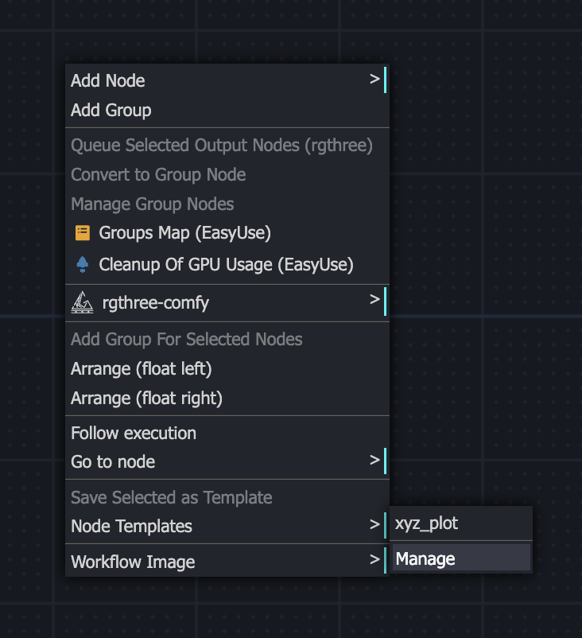
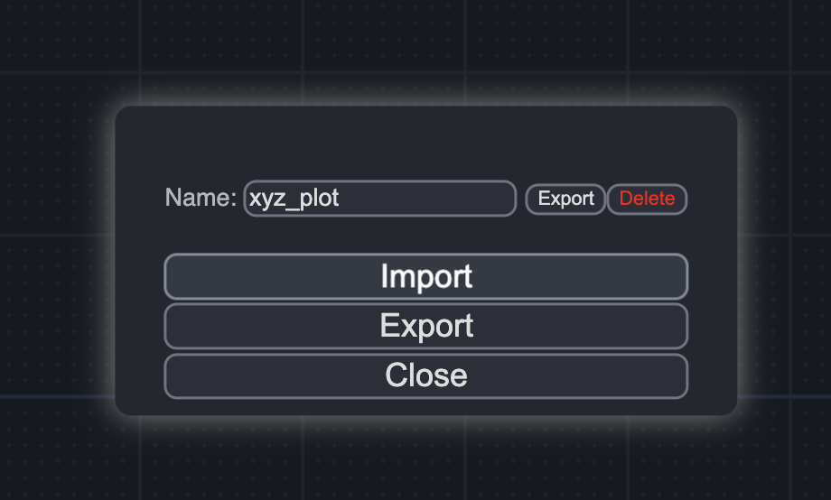
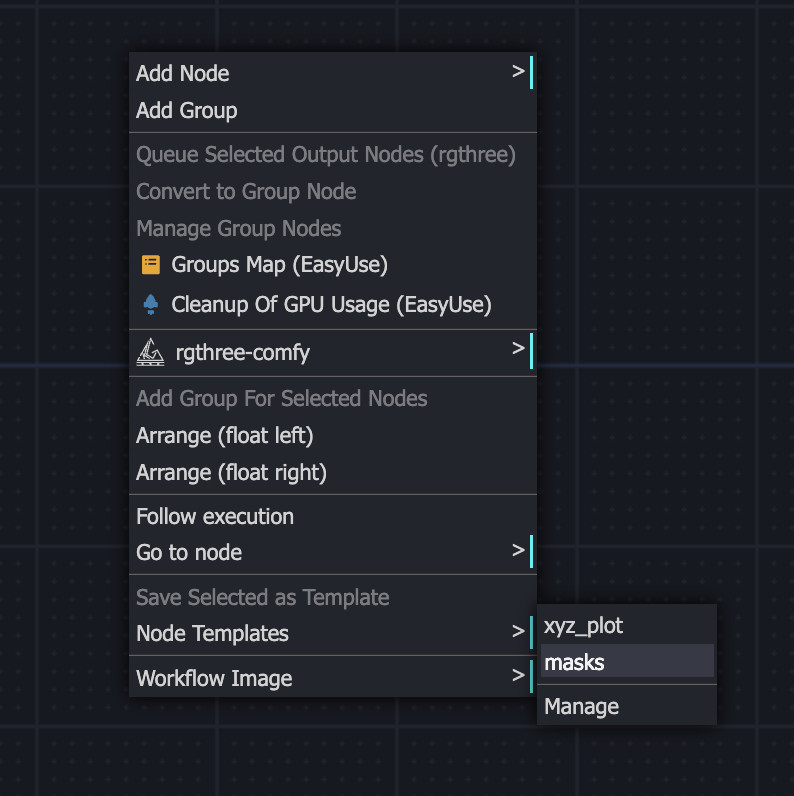
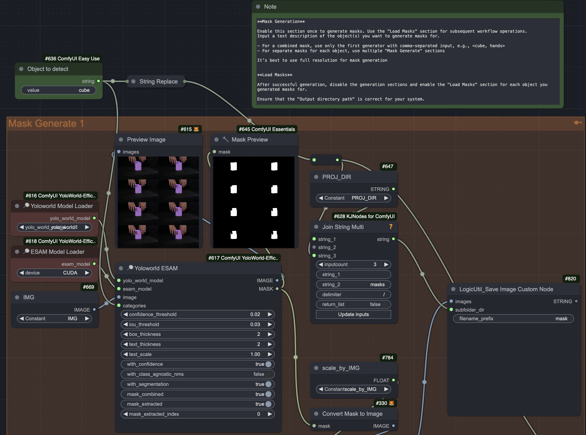
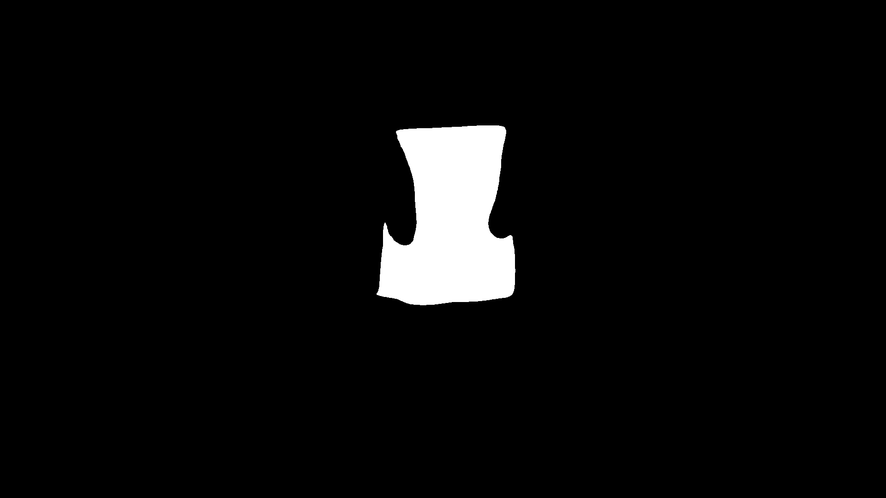
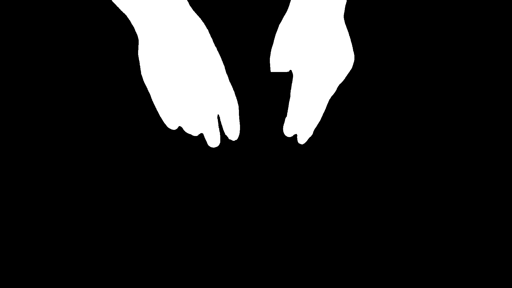
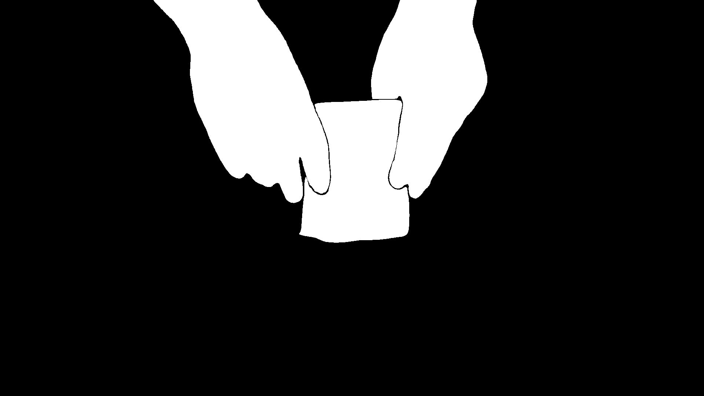
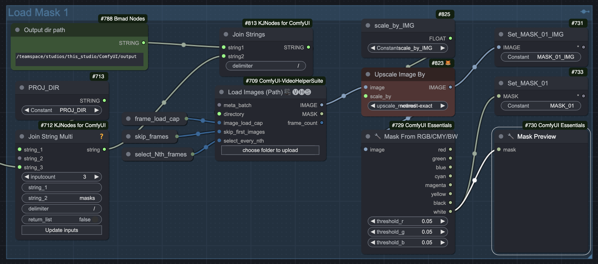

# Masking

## Requirements

[YoloWorld-EfficientSAM](https://github.com/ZHO-ZHO-ZHO/ComfyUI-YoloWorld-EfficientSAM)

download [efficient_sam_s_cpu.jit](https://huggingface.co/camenduru/YoloWorld-EfficientSAM/resolve/main/efficient_sam_s_cpu.jit) and [efficient_sam_s_gpu.jit](https://huggingface.co/camenduru/YoloWorld-EfficientSAM/resolve/main/efficient_sam_s_gpu.jit) 
and put them into folder:

`custom_nodes/ComfyUI-YoloWorld-EfficientSAM `

## Usage

Import this `template_mask.json` to add neccessary nodes.

|  |  |  |
|:----------------:|:----------------:|:----------------:|
| Template Manager  | Import template  | Load Template  |

❗️ If you want to use it in your own workflow, you'd need to adjust `Set` and `Get` variables that are used in this template.

### Generating Masks

- Set your `PROJECT_DIR` in Load Video group, this will create this project dir in your `outputs` dir. Masks will be saved there.
- Input a text description of the object(s) you want to generate masks for into `Object to detect` node.
- Adjust `confidence_threshold` if your object detected incorrectly or not detected.

💡 You can read more about detection parameters [here](https://supervision.roboflow.com/develop/notebooks/zero-shot-object-detection-with-yolo-world/#run-object-detection)

You can generate masks for separate objects and save them separately or as a combined mask.

For separate masks for multiple objects, use separate `Mask Generate` groups for each object, duplicate group if needed.

For combined mask of multiple objects just use comma-separated input for `Object to detect` node. For example - `hands, cube`

|  |  |  |
|:----------------:|:----------------:|:----------------:|
| `cube`  | `hands`  | `cube, hands`  |

❗️ After successful generation disable(RMB->Bypass or Ctrl+B) these groups and use `Load Masks` groups for the rest of your workflow.

### Load Masks

Enable relevant `Load Masks` groups

Make sure that `Output dir path` has a correct path to your `output` folder.

💡 Notice that `Object to detect` Node is used to compose the path to the folder with masks.
